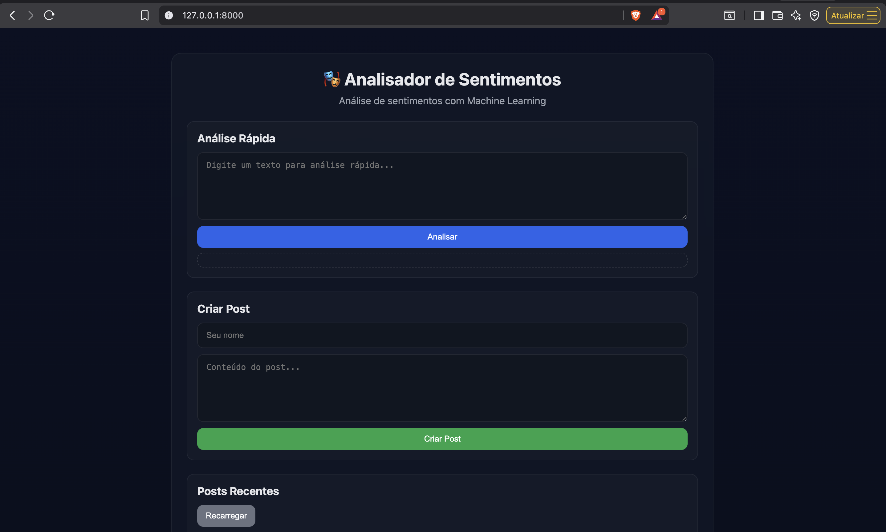
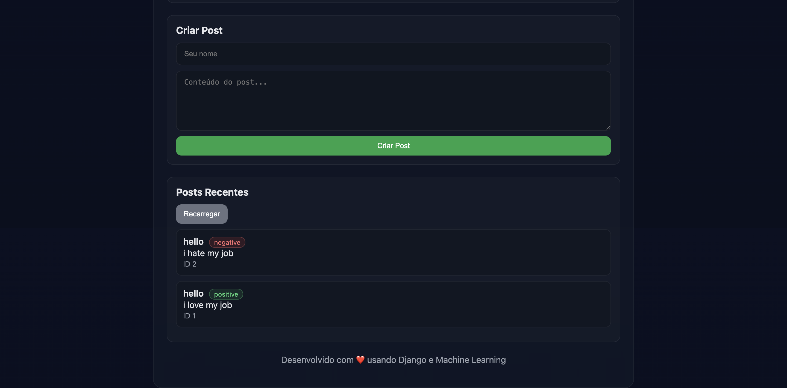

# Mini Project – API de Análise de Sentimentos (Django)

Um projeto Django REST API que analisa o sentimento de textos. Ele permite criar posts com análise automática de sentimento e também analisar textos sem salvar no banco.

## Visão geral

- Backend: Django 4.2 + Django REST Framework
- Análise de Sentimentos: TextBlob
- Banco de dados padrão: SQLite (PostgreSQL opcional via Docker)
- Conteúdo estático servido por Django (Nginx opcional via Docker)
- Testes automatizados inclusos

## Estrutura do repositório

```
mini_project/
├── mini_project/            # Configurações do projeto Django
│   ├── settings.py
│   ├── urls.py
│   └── wsgi.py
├── sentiment/               # App de sentimentos
│   ├── models.py            # Modelo Post
│   ├── serializer.py        # Serializers DRF
│   ├── views.py             # ViewSet e endpoint de análise
│   ├── urls.py              # Rotas da API
│   ├── model.py             # Função predict_sentiment (TextBlob)
│   └── tests.py             # Testes
├── templates/
│   └── index.html           # Página simples (opcional)
├── static/                  # Arquivos estáticos de desenvolvimento
├── Dockerfile               # Imagem Docker (dev/prod)
├── docker-compose.yml       # Orquestração (web, db, nginx)
├── docker-entrypoint.sh     # Script de inicialização do container
├── nginx.conf               # Nginx para produção (perfil opcional)
├── requirements.txt         # Dependências Python
└── manage.py
```

## Como funciona a análise de sentimentos

Em `sentiment/model.py`, a função `predict_sentiment(text)` usa TextBlob para calcular a polaridade do texto (-1 a +1) e classifica como:
- positive (polarity > 0)
- negative (polarity < 0)
- neutral (polarity == 0 ou texto vazio)

Observação: Há código de exemplo com scikit-learn não utilizado na predição atual. A biblioteca não é necessária para rodar o projeto.

## Endpoints principais

- `GET /api/posts/` — Lista posts (lista simples, sem paginação)
- `POST /api/posts/` — Cria post com sentimento calculado automaticamente
- `GET /api/posts/{id}/` — Detalha um post
- `PUT/PATCH /api/posts/{id}/` — Atualiza post (recalcula sentimento)
- `DELETE /api/posts/{id}/` — Remove post
- `POST /api/posts/analyze/` — Analisa um texto sem salvar

Exemplo: criar post
```
POST /api/posts/
Content-Type: application/json
{
  "author": "João Silva",
  "content": "Este é um texto incrível!"
}
```
Resposta (exemplo):
```
{
  "id": 1,
  "author": "João Silva",
  "content": "Este é um texto incrível!",
  "sentiment": "positive",
  "created_at": "2025-10-27T20:00:00Z",
  "updated_at": "2025-10-27T20:00:00Z"
}
```

Exemplo: analisar sem salvar
```
POST /api/posts/analyze/
Content-Type: application/json
{
  "text": "Estou muito feliz hoje!"
}
```
Resposta (exemplo):
```
{ "text": "Estou muito feliz hoje!", "sentiment": "positive" }
```

## Rodando localmente (sem Docker)

Requisitos: Python 3.11+, pip

1) Criar venv e instalar dependências
```bash
python -m venv .venv
source .venv/bin/activate  # no Windows: .venv\Scripts\activate
pip install -r requirements.txt
```

2) Migrar e iniciar
```bash
python manage.py migrate
python manage.py runserver
```
Acesse: http://localhost:8000

3) Testes
```bash
python manage.py test -v 2
```

## Rodando com Docker

Pré-requisitos: Docker e Docker Compose.

1) Subir containers em modo desenvolvimento
```bash
docker compose up --build
```
- Web (Django runserver) em http://localhost:8000
- PostgreSQL opcional em 5432 (não utilizado por padrão, já que o projeto usa SQLite sem `dj-database-url`)
- Nginx disponível apenas no perfil de produção (veja abaixo)

2) Executar comandos no container web
```bash
docker compose exec web python manage.py migrate
docker compose exec web python manage.py createsuperuser
```

3) Produção (com Nginx)
- O serviço `nginx` está sob o perfil `production` no docker-compose.
- Para um cenário de produção, recomenda-se usar Gunicorn em vez do runserver.

Subir com Nginx (perfil production):
```bash
docker compose --profile production up -d --build
```
Para usar Gunicorn (exemplo de override do comando do serviço web):
```bash
docker compose run --rm web \
  gunicorn mini_project.wsgi:application --bind 0.0.0.0:8000 --workers 3
```
Você também pode ajustar o `command:` do serviço `web` no docker-compose quando for para produção.

## Sobre o Dockerfile

- Base: `python:3.11-slim`
- Instala dependências do sistema (gcc) e Python (requirements.txt)
- Copia o projeto para `/app`
- Executa `collectstatic` na build (com `|| true` para não falhar em ambientes sem configuração completa)
- Cria usuário não-root `appuser` e roda a aplicação como esse usuário
- Entrypoint: `docker-entrypoint.sh`
- Comando padrão: `python manage.py runserver 0.0.0.0:8000`

## Sobre o docker-entrypoint.sh

- Shell POSIX (`#!/bin/sh`) para maior compatibilidade
- Roda: `makemigrations`, `migrate`, `collectstatic`
- Cria superusuário automaticamente se não existir, com variáveis de ambiente configuráveis:
  - `DJANGO_SUPERUSER_USERNAME` (padrão: `admin`)
  - `DJANGO_SUPERUSER_EMAIL` (padrão: `admin@example.com`)
  - `DJANGO_SUPERUSER_PASSWORD` (padrão: `admin123`)
- Ao final, executa o comando recebido (por padrão, `runserver`), via `exec "$@"`

## Variáveis de ambiente úteis

- `DEBUG` (default: True)
- `SECRET_KEY` (use uma chave forte em produção)
- `ALLOWED_HOSTS` (ex.: `seu-dominio.com,localhost`)
- Superusuário (ver seção anterior)

Observação: O `DATABASE_URL` está presente no docker-compose, mas o projeto não utiliza `dj-database-url`. O SQLite é usado por padrão conforme `settings.py`. Se desejar PostgreSQL, adapte as configurações do Django ou adicione `dj-database-url` e a configuração correspondente.

## Dicas e resolução de problemas

- Coleta de estáticos: é executada na build e também no entrypoint; em dev isso é redundante, porém inofensivo.
- Caso a análise de sentimentos falhe, verifique a instalação do `textblob` (já presente em `requirements.txt`).
- Se for usar PostgreSQL, ajuste `DATABASES` em `settings.py` ou adicione suporte a `DATABASE_URL`.

## Screenshots





## Licença

MIT. Veja o arquivo LICENSE.

---

**Desenvolvido com ❤️ usando Django e Machine Learning**
